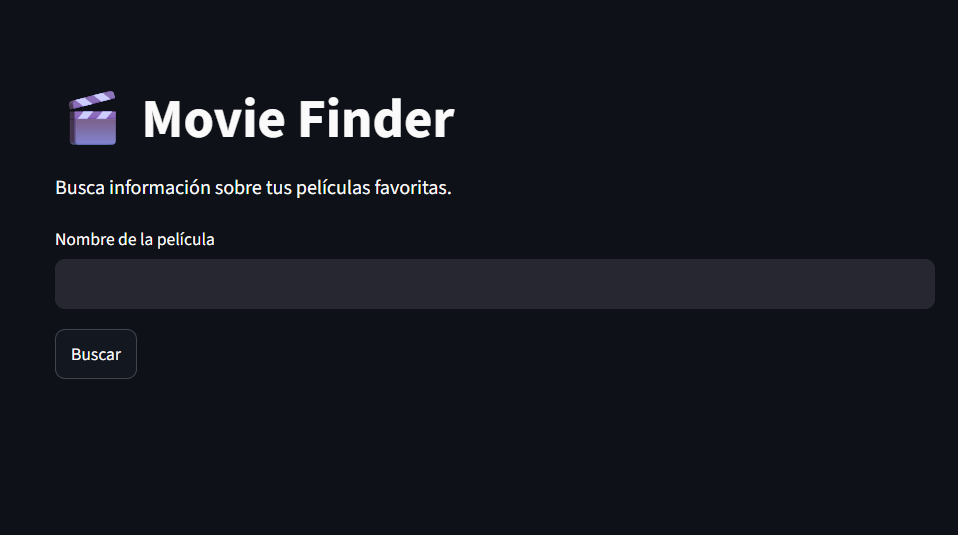
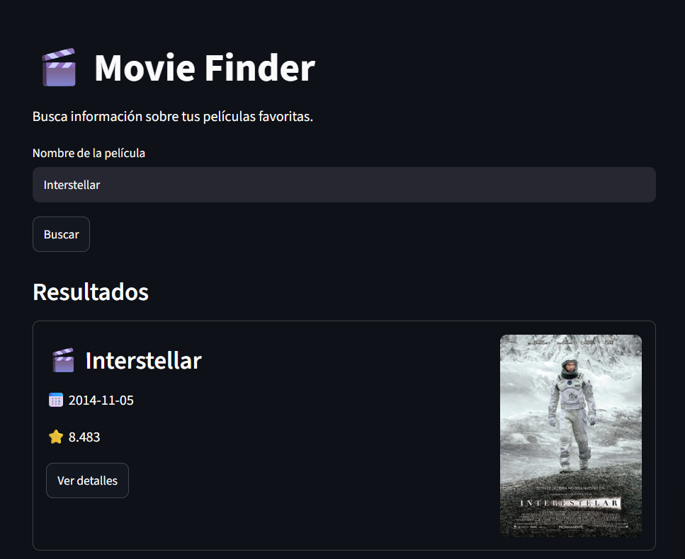
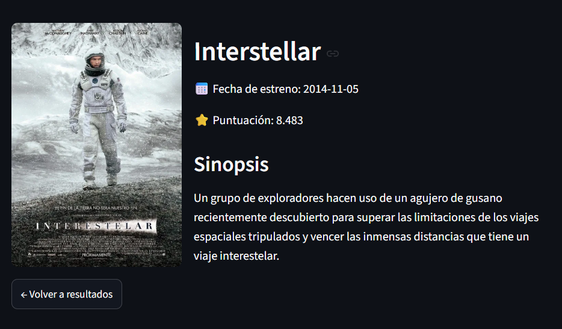

# Movie Finder

Movie Finder is a Python application that allows users to search for movies using the TMDB (The Movie Database) API.

The application provides a simple web interface built with Streamlit, where users can search for a movie, browse the results, and view detailed information about each title.

---

## About the Project

This project was developed as a learning exercise to practice working with REST APIs and building interactive web applications using Streamlit. It also focuses on writing clean, modular, and maintainable Python code.

---

## Features

- Search movies by title.
- Display multiple search results.
- View detailed information, including:
  - Title
  - Release date
  - Rating
  - Overview
  - Official movie poster
- Navigate between the search results and the movie details page.
- Handle missing or unavailable data gracefully.

---

## Technologies

- Python
- Streamlit
- Requests
- TMDB API

---

## Project Structure

```
movie-finder/
│
├── app.py                  # Application entry point
├── api.py                  # TMDB API communication
├── display_streamlit.py    # User interface
├── utils.py                # Helper functions
├── requirements.txt
└── README.md
```

---

## Installation

Clone the repository:

```bash
git clone https://github.com/avictoriab/Movie_explorer.git
```

Navigate to the project directory:

```bash
cd movie-explorer
```

Install the required dependencies:

```bash
pip install -r requirements.txt
```

Configure your TMDB API key.

Run the application:

```bash
streamlit run app.py
```

---

## Screenshots

### Home Page



### Search Results



### Movie Details



---

## Learning Outcomes

This project was developed to practice:

- Consuming REST APIs.
- Working with JSON responses.
- Organizing a Python project into modules.
- Separating application logic from the presentation layer.
- Building web interfaces with Streamlit.
- Managing application state using `st.session_state`.
- Refactoring and improving code structure.

---

## Acknowledgements

Movie data and images are provided by **The Movie Database (TMDB)**.

https://www.themoviedb.org/